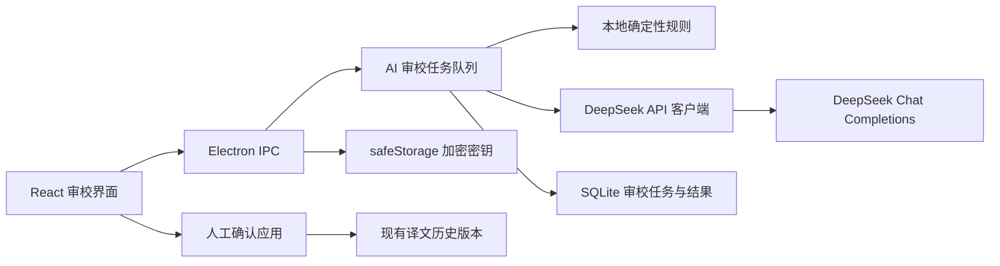

# DeepSeek 翻译 AI Agent 与审校 - 提案

> **状态**：评审中
> **创建日期**：2026-07-15
> **最后更新**：2026-07-15

## 背景

当前桌面应用已经具备 TMX 项目管理、搜索筛选、编辑、历史版本和 Excel 导出，但翻译质量检查仍依赖人工逐条完成。翻译人员需要在不失去人工控制权的前提下，快速发现错译、漏译、术语不一致、语言错误和格式问题，并批量处理可靠的修正建议。

## 核心价值

让翻译人员拥有一个理解当前项目、可以持续问答和调用翻译工具的 AI Agent，并在可暂停、可恢复、可追溯的工作流中完成整项目审校，同时确保 AI 不会未经确认覆盖原译文。

## 目标

- [ ] 支持用户在应用设置中配置并验证自己的 DeepSeek API Key。
- [ ] 支持当前条目、筛选结果和整个项目三种审校范围。
- [ ] 覆盖语义准确性、漏译/多译、术语一致性、语法拼写、流畅度、语气、本地化规范和格式保护等常见检查。
- [ ] 将确定性问题交给本地规则，将语义问题交给 DeepSeek，并统一展示结果。
- [ ] 支持在整批审查完成后统一预览结果，逐条接受、拒绝、编辑或取消勾选，再一次性提交被接受的建议。
- [ ] 记录审校任务、模型、规则版本、耗用量、问题结论和建议应用历史。
- [ ] 批量任务支持进度、取消、失败重试和应用重启后恢复。
- [ ] 支持项目级历史会话、会话搜索、继续问答、消息重试、分支和检查点恢复。
- [ ] 支持 Agent 调用项目搜索、条目读取、规则检查、审校任务和暂存建议工具，并展示调用过程。

## 非目标

- 第一版不接入 DeepSeek 之外的模型供应商。
- 第一版不允许 AI 静默自动覆盖译文。
- 第一版不让模型自主决定检查范围、跳过条目或直接写数据库；自动推进由应用任务队列控制。
- 第一版不允许 Agent 绕过确认门直接修改正式译文、源文、历史版本或删除项目数据。
- 第一版不做多人在线协作、云端项目同步或统一后台账号体系。
- 第一版不把 API Key 写入 SQLite、TMX、Excel、日志或安装包。
- 第一版不承诺 AI 结论百分之百正确，最终决策仍由翻译人员负责。

## 范围

### 第一版包含

#### 0. 前置任务：统一 UI 基础组件与 Markdown 渲染

AI 功能开发前必须先完成基础 UI 层统一，现有业务行为和页面结构保持不变：

1. **初始化 shadcn/ui**：为现有 Next.js 项目增加 `components.json`、`cn` 工具、CSS 变量和统一设计 token；底层选择 Radix，以便与 AI Elements 保持一致。
2. **迁移基础控件**：所有通用按钮、图标按钮、输入框、文本域、标签、选择器、复选框、单选框、开关、徽标、工具提示、进度条、骨架屏、分隔线和滚动区统一使用 shadcn/ui。
3. **迁移浮层与反馈**：确认框、普通弹窗、右侧栏、下拉菜单、弹出层、命令搜索、提示信息和 Toast 分别使用 shadcn/ui 的 `AlertDialog`、`Dialog`、`Sheet`、`DropdownMenu`、`Popover`、`Command`、`Alert` 和 `Sonner`。
4. **迁移业务组合组件**：分页、筛选栏、编辑工具栏和项目表单由 shadcn/ui 原语组合；虚拟翻译表格继续保留 TanStack Virtual 和领域逻辑，只统一表头、按钮、筛选器、状态和分页控件。
5. **建立约束**：业务组件不再直接实现重复的基础控件；新组件优先从 `components/ui` 组合，确有领域行为时才创建业务组件。
6. **接入 Streamdown**：AI 最终回答和历史回答统一通过 `Streamdown` 渲染，不再维护自定义 Markdown 解析器。
7. **验证兼容性**：完成现有交互回归、键盘操作、焦点管理、静态导出、Electron 构建和 Windows 打包验证后，才开始 Agent 功能开发。

shadcn/ui 采用源码组件方式，只添加实际使用的组件，不引入整套组件包。现有 Tailwind CSS 3.4 第一阶段保持不变；shadcn/ui 和 Streamdown 都按当前 Tailwind 配置接入，避免 UI 前置任务同时扩大为 Tailwind 大版本升级。

Streamdown 第一版配置：

- `streamdown`：处理流式、不完整 Markdown，支持 GFM 表格、列表、链接和渐进渲染。
- `@streamdown/cjk`：修复中文、日文、韩文附近的强调符号、删除线和自动链接边界。
- `@streamdown/code`：为代码块提供按需语法高亮、复制操作和明暗主题。
- 流式回答使用 streaming 模式，历史完整消息使用 static 模式。
- 禁用原始 HTML；链接协议只允许 `http`、`https` 和 `mailto`，外部链接交给 Electron 安全打开。
- 第一版不启用 Mermaid、数学公式和任意远程图片；后续按明确业务场景增加插件。

#### 1. AI 设置

- API Key 输入、遮罩显示、保存、删除和连接测试。
- 每次进入 AI 模式或启动任务前检查 Key 是否存在且可解密；未配置时直接引导到设置，已配置但尚未验证或验证过期时先执行连接测试。
- 使用 Electron `safeStorage` 的异步接口加密保存，Windows 由 DPAPI 保护。
- 模型限定为 DeepSeek：默认 `deepseek-v4-flash`，可选 `deepseek-v4-pro` 深度审校。
- 超时、重试次数和批量并发使用安全默认值，不向普通用户暴露过多参数。
- 首次启用时明确提示：所选源文、译文和必要上下文会发送到 DeepSeek API。

#### 2. 审校能力

- **准确性**：错译、漏译、多译、否定关系、主体/客体、时态和条件关系。
- **术语**：项目术语表、同源句重复译法、关键产品名和专有名词一致性。
- **语言质量**：拼写、语法、大小写、标点、可读性、自然度和目标语言表达。
- **本地化**：日期、数字、小数点、单位、引号和地区表达习惯。
- **格式保护**：占位符、变量、标签、数字、单位和不可翻译片段。
- **源文问题**：源文疑似错误、歧义或信息不足，单独标记，不直接改写源文。
- **快速操作**：当前译文“AI 审校”“AI 纠错”“AI 润色”，均先展示差异再应用。

#### 3. 批量审校工作流

- 工作台最右侧增加“编辑 / AI 模式”切换，进入 AI 模式后显示独立审校控制台。
- AI 模式入口首先执行 API Key 前置检查，Key 未配置、无法解密或连接失败时不得创建审校任务。
- AI 模式第一步必须选择筛选条件并计算检查范围，不输入条件时可明确选择整个项目。
- 用户确认查询范围，以及允许 AI 生成纠正建议的类别、严重程度和字段边界后启动任务；第一版 AI 只能生成目标译文建议，不自动改写源文。
- 本地规则先运行；AI 请求按固定 token 预算分批，默认低并发执行。
- DeepSeek 请求自动开启思考模式；当前条目的思考流可以展开查看，但不作为最终审校结论持久化。
- 每完成一条即将结果持久化到 AI 暂存表并自动处理下一条；此时不修改正式译文，界面可选择是否跟随当前检查条目。
- 显示总数、已完成、发现问题、失败数、预计剩余量和取消按钮。
- 支持暂停、继续、停止；停止保留已完成结果，重新开始时跳过内容未变化的已完成条目。
- 网络中断、429、500、503 和空 JSON 结果采用有限次数指数退避重试。
- 任务与分批结果持久化到 SQLite 暂存区，关闭应用后可以继续。
- 全部审查完成后统一进入结果确认页；用户确认提交后，系统才把被接受的建议一次性写入正式翻译数据和修改历史。

#### 3.1 AI 模式界面状态

AI 模式使用明确状态机，不以聊天消息作为主导航：

1. **范围设置**：选择搜索词、源/目标语言、译文状态、修改状态、重复项、行号范围、仅未审校项和当前选中项。
2. **范围与纠正边界确认**：显示命中条数、抽样预览、预计批次数、允许纠正的类别与字段，以及将发送给 DeepSeek 的内容。
3. **执行中**：显示总体进度、当前条目、思考状态、检查阶段、token、问题数和失败数。
4. **暂停/恢复**：保留任务快照，用户可以查看已完成结果后继续。
5. **结果审阅**：整批检查完成后查看全部结果，逐条接受、拒绝、编辑或取消勾选；此阶段仍不修改正式译文。
6. **提交确认**：展示将修改的条目数和差异摘要，经用户最终确认后，在单个数据库事务中写入正式译文并生成修改历史。

状态转换：`检查 Key → 配置范围与纠正边界 → 等待确认 → 检查中 → 暂停/继续 → 部分失败或完成 → 结果审阅 → 提交确认 → 已应用`。

#### 3.2 AI Elements 组件映射

项目引入 AI Elements，但只安装需要的源码组件，并适配现有紧凑型工作台样式：

- `Queue`：当前、待处理、已完成、失败条目的队列概览。
- `Task`：展示当前条目的本地规则检查、AI 语义审校、结果校验和保存阶段。
- `Reasoning`：折叠显示当前 DeepSeek 思考流；执行时展开，结束后自动收起。
- `Context`：显示输入、输出、推理、缓存 token 和粗略成本。
- `Confirmation`：用于开始整批检查、停止任务和最终提交被接受建议的二次确认。
- `Message`：在批量审校页展示问题说明与纠错依据，在 Agent 会话页承载可持久化的历史问答。
- `PromptInput`：可选的“本次补充审校要求”，不用于改变检查范围或授予写入权限。

AI Elements 是基于 shadcn/ui 的可复制源码组件。第一版只引入上述组件和必要的 Radix 依赖，不引入完整组件库，也不使用嵌套卡片式聊天布局。

#### 3.3 自动向下执行规则

- 启动时把筛选结果固化为不可变的 `rowId + 内容哈希` 快照，执行期间用户修改筛选条件不会改变当前任务。
- 执行器按快照顺序领取下一条，不由模型决定下一条。
- 当前条目先执行本地规则，再调用 DeepSeek 思考模式，最终返回 Zod 校验后的结构化结果。
- 完成、无问题、失败、跳过均写入批次状态，然后自动领取下一条。
- 用户修改正在等待或已完成的译文时，对应任务项标记为“内容已变化”；未开始项使用新内容重新入队，已完成建议标记过期。
- 默认单并发保证顺序和界面跟随稳定；后续可提升为 2–3 并发，但界面仍按原始顺序展示。

#### 3.4 项目级 AI Agent 会话

- 每个项目拥有独立的 AI 会话列表；支持新建、自动命名、重命名、置顶、搜索、归档和删除会话。
- 会话保存用户消息、最终回答、引用的项目条目、工具调用、确认记录、token、模型和错误状态。
- 支持停止生成、重新生成、编辑问题后重发、复制回答和从任一检查点创建会话分支。
- 再次进入项目或重启应用时，默认打开最近会话，并从最后一条完整消息继续追问。
- Agent 可以引用当前选中条目、当前筛选快照、审校任务和暂存结果，但必须明确显示本轮使用的上下文范围。
- 长会话采用“最近消息 + 持久化摘要 + 固定项目事实 + 按需检索条目”的上下文策略，避免每次发送完整项目和全部历史。
- 每个用户消息、Agent 最终回答、工具调用完成和人工确认后创建持久化检查点。
- 应用正常运行但界面切换时，Electron 主进程继续消费并保存当前流；应用被完全关闭或进程异常后，无法续接原 DeepSeek 网络流，将把本轮标记为中断并从最后检查点发起新的续答请求。

#### 3.5 Agent 工具与权限边界

第一版提供以下白名单工具，参数全部使用 Zod 校验：

- `getProjectSummary`：读取项目语言、条目数、修改状态和审校概况。
- `searchTranslationUnits`：按关键词、语言、状态和范围查询条目。
- `getTranslationUnit`：读取指定条目的原文、译文和历史摘要。
- `runLocalChecks`：执行占位符、标签、数字、空译文和重复项等本地规则。
- `createAuditDraft`：根据用户描述生成审校范围与纠正边界草案，仍需用户确认后才能启动。
- `inspectAuditResults`：读取审校进度、问题分布和暂存建议。
- `draftTranslationChange`：为指定条目生成暂存建议和差异，不修改正式译文。
- `updateStagedSuggestion`：根据用户追问调整暂存建议。
- `prepareApplySet`：生成待提交集合和差异摘要，必须进入 `Confirmation`。

工具权限分三级：读取工具可自动执行；生成草案和写入 AI 暂存区的工具执行后必须可撤销；任何正式数据库写入都必须由用户明确确认并通过应用事务执行。Agent 永远不能直接执行 SQL 或调用任意文件、网络和系统命令。

#### 3.6 Agent 会话界面

AI 模式内部使用 `会话 / 审查任务 / 结果确认` 三个页签，左侧抽屉显示项目历史会话：

- `Conversation` 与 `Message`：呈现流式问答、Markdown、复制和重新生成。
- `Message` 的正文渲染统一使用 Streamdown；AI Elements 负责消息结构和操作，Streamdown 负责 Markdown 内容。
- `PromptInput`：继续追问，并提供“引用当前条目”“引用当前筛选结果”等明确上下文按钮；第一版不开放任意文件附件。
- `Reasoning`：展示当前轮次思考状态，默认折叠且不持久化完整推理文本。
- `Tool`：展示工具名称、参数摘要、执行状态、结果和错误。
- `Checkpoint`：标记可恢复节点，并支持从节点创建新分支，不直接覆盖原会话历史。
- `Confirmation`：处理启动整批审查、停止任务、写入正式译文等高影响动作。
- `Queue`、`Task`、`Context`：继续用于审查队列、执行阶段和 token/成本信息。

会话历史不是简单保存一段纯文本，而是保存 AI SDK `UIMessage` 风格的结构化消息部件，加载时进行 schema 校验，确保工具调用和确认状态可以正确恢复。

#### 4. 审校结果中心

- 表格中增加 AI 状态与问题数量，支持按严重度、类别、处理状态筛选。
- 右侧审校面板显示源文、当前译文、问题说明、证据、建议译文和置信度。
- 支持接受、拒绝、编辑后接受、跳过，以及对最终提交集合进行勾选和取消勾选。
- 审阅阶段的操作只更新 AI 暂存结果；最终确认时复用现有完整历史版本机制，记录来源为 AI 审校。
- 最终写入使用单个数据库事务：任意正式数据写入失败则整体回滚，并保留暂存结果供用户重试。
- 原译文在审校后又被人工修改时，将旧建议标记为“已过期”，禁止直接应用。
- Excel 可选择附加审校状态、问题类别、说明和建议译文列。

#### 5. 成本与缓存

- 保存每次任务的输入、输出和缓存命中 token 数量，不保存推理过程。
- 按“源文 + 译文 + 规则 + 模型 + 提示词版本”生成哈希，未变化内容复用本地结果。
- 启动整项目审校前显示条目数量和粗略调用规模；任务中显示累计 token。

### 后续版本考虑

- 用户自定义审校规则和提示词模板。
- 可导入/维护项目术语表并自动生成术语候选。
- 项目级一致性二次审校和跨项目翻译记忆参考。
- 对已确认的低风险规则提供受控的自动修复策略。
- 审校报告 PDF、团队共享和集中式 API 网关。

## 推荐方案

### 方案 A：只做单条 AI 按钮

开发最快，但无法满足整项目审计、任务恢复、一致性检查和批量处理，只适合作为原型。

### 方案 B：本地规则 + DeepSeek 批量审校队列（推荐）

本地规则负责确定性检查，DeepSeek 负责语义判断；结果进入统一审校中心，人工确认后应用。开发量适中，准确性、成本、可控性和扩展性最平衡。

### 方案 C：AI 自动重写整个项目

操作最省，但误改风险、审计风险和成本最高，也会削弱现有历史版本与人工编辑流程，因此不用于第一版。

## 高层架构

所有 DeepSeek 网络请求都从 Electron 主进程发出，渲染页面无法读取明文 Key。请求使用 JSON Output，并在本地进行结构校验、字段白名单、rowId 对齐和内容哈希校验。

AI 调用层确定使用 Vercel AI SDK 7 Core、`@ai-sdk/deepseek` 和 Zod。自由问答与多步工具调用使用 `ToolLoopAgent`；范围固定、需要可靠恢复的批量审查继续使用显式结构化工作流。Electron 主进程通过 AI SDK 事件流接收 reasoning、工具调用、最终内容和 token 元数据，再通过类型化 IPC 发送给渲染层。由于当前应用是静态导出的 Electron 页面，不使用 Next.js API Route，也不在渲染层直接连接 DeepSeek。

审校请求使用 `deepseek-v4-flash` 或 `deepseek-v4-pro`，并显式设置 `thinking: { type: "enabled" }`。最终结论使用 `Output.object()` 约束结构；思考流只用于执行反馈，不进入修改历史、不导出 Excel，也不作为用户必须阅读的审计证据。

## 建议的数据结构

- `ai_settings`：模型、默认规则、并发和加密 Key 文件引用，不存明文 Key。
- `ai_audit_jobs`：范围、筛选快照、状态、进度、token、错误、开始/结束时间。
- `ai_audit_batches`：分批状态、尝试次数、请求哈希和 token 用量。
- `ai_audit_findings`：rowId、类别、严重度、说明、证据、建议译文、置信度、处理状态、内容哈希、模型和提示词版本。
- `ai_audit_apply_sets`：最终确认前的提交集合、选中状态、人工编辑后的建议、提交状态和事务错误。
- `ai_glossary_terms`：源术语、目标术语、大小写规则、备注和启用状态。
- `ai_audit_events`：任务开始、暂停、恢复、当前条目和进度事件；只保留状态摘要，不保存完整思考过程。
- `ai_agent_sessions`：projectId、标题、状态、置顶、摘要、模型、最近消息和创建/更新时间。
- `ai_agent_messages`：sessionId、parentMessageId、分支、角色、结构化消息部件、状态、token 和时间。
- `ai_agent_runs`：每轮 Agent 执行状态、起止检查点、错误、模型、提示词版本和 token。
- `ai_agent_tool_calls`：工具名、脱敏参数、结果摘要、确认状态、幂等键和错误。
- `ai_agent_checkpoints`：会话分支、消息位置、上下文摘要、未完成动作和恢复状态。

## 风险与缓解

| 风险 | 可能性 | 影响 | 缓解措施 |
|------|--------|------|----------|
| AI 误判或建议不可靠 | 高 | 高 | 不自动覆盖；展示差异、证据和置信度；人工确认 |
| API Key 泄露 | 中 | 高 | 主进程调用；`safeStorage` 加密；日志脱敏；不导出 Key |
| 翻译内容发送到云端 | 高 | 高 | 首次明确告知；只发送必要字段；元数据默认不发送；允许完全关闭 AI |
| JSON 为空、截断或格式错误 | 中 | 中 | 结构校验、有限重试、批次缩小、失败可恢复 |
| 批量任务中断 | 中 | 中 | SQLite 持久化任务和批次；幂等哈希；重启续跑 |
| 会话生成中断 | 中 | 中 | 主进程持续消费流；逐事件保存；进程退出后从最后完整检查点重新请求，不声称续接已断开的远端流 |
| 长会话超出上下文 | 高 | 中 | 持久化摘要、最近消息窗口、按需项目检索和 token 预算 |
| Agent 越权调用工具 | 中 | 高 | 工具白名单、Zod 参数校验、分级权限、确认门和正式写入事务 |
| UI 基础组件迁移造成行为回归 | 中 | 中 | 分层迁移；保留领域逻辑；组件测试、键盘测试、静态构建和桌面打包作为 Agent 开发前置门槛 |
| AI Markdown 包含危险链接或 HTML | 中 | 高 | Streamdown 禁用原始 HTML；限制链接协议；外链通过 Electron 安全处理；不加载任意远程图片 |
| 建议基于旧译文 | 中 | 高 | 保存输入内容哈希；应用前重新校验，不一致即标记过期 |
| 最终批量写入部分成功 | 低 | 高 | 正式应用使用单个数据库事务；失败整体回滚，暂存结果继续保留 |
| 成本失控 | 中 | 中 | 默认 Flash、本地规则前置、缓存、低并发、范围确认、token 统计 |
| 提示词注入 | 低 | 中 | 将 TMX 内容作为数据隔离；固定系统规则；严格验证输出，不执行模型指令 |
| 思考内容过长或含无关信息 | 中 | 中 | 默认折叠；只展示当前项；不持久化、不导出；以最终结构化结论为准 |
| 执行中筛选变化导致范围漂移 | 中 | 高 | 启动时固化 rowId 与内容哈希快照，任务范围不可变 |

## 成功指标

| 指标 | 第一版目标 |
|------|------------|
| 批量任务可恢复性 | 应用重启后可继续未完成任务 |
| 建议安全性 | 未经人工确认的建议不会修改译文 |
| 结果可追溯性 | 每次接受均进入现有修改历史 |
| 过期保护 | 译文变化后旧建议不能直接应用 |
| 结构化结果稳定性 | 空结果或无效 JSON 可重试并明确显示失败 |
| 常见场景覆盖 | 至少覆盖准确性、术语、语言、格式、本地化五大类 |
| 会话连续性 | 重启后可打开历史会话并从最后完整检查点继续追问 |
| Agent 可控性 | 每次工具调用可查看；正式数据写入必须经过用户确认 |
| UI 一致性 | 所有通用基础控件来自 `components/ui`，业务组件只负责组合与领域行为 |
| Markdown 稳定性 | 流式中断语法、CJK 强调、GFM 表格和代码块可正确渲染 |

## 待确认问题

- [ ] 第一版是否同时开放 `deepseek-v4-flash` 和 `deepseek-v4-pro`，还是只保留 Flash？推荐两者都保留，默认 Flash。
- [ ] 第一版术语表是否需要用户手工维护，还是先只支持从项目重复内容中检查一致性？推荐第一版加入轻量术语表。

## 参考资料

- DeepSeek API：https://api-docs.deepseek.com/
- DeepSeek JSON Output：https://api-docs.deepseek.com/guides/json_mode
- DeepSeek 模型与价格：https://api-docs.deepseek.com/quick_start/pricing
- DeepSeek 限流与隔离：https://api-docs.deepseek.com/quick_start/rate_limit
- DeepSeek 思考模式：https://api-docs.deepseek.com/guides/thinking_mode
- Electron safeStorage：https://www.electronjs.org/docs/latest/api/safe-storage
- AI SDK DeepSeek Provider：https://ai-sdk.dev/providers/ai-sdk-providers/deepseek
- AI SDK Agents：https://ai-sdk.dev/docs/agents/overview
- AI SDK 消息持久化：https://ai-sdk.dev/docs/ai-sdk-ui/chatbot-message-persistence
- AI Elements Checkpoint：https://elements.ai-sdk.dev/components/checkpoint
- AI Elements：https://elements.ai-sdk.dev/
- shadcn/ui Next.js：https://ui.shadcn.com/docs/installation/next
- Streamdown：https://streamdown.ai/docs
- Streamdown CJK：https://streamdown.ai/docs/plugins/cjk
- Streamdown Security：https://streamdown.ai/docs/security
